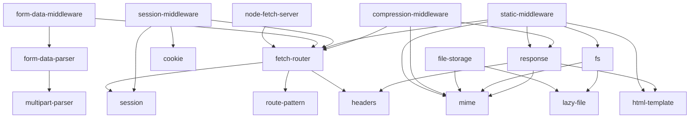
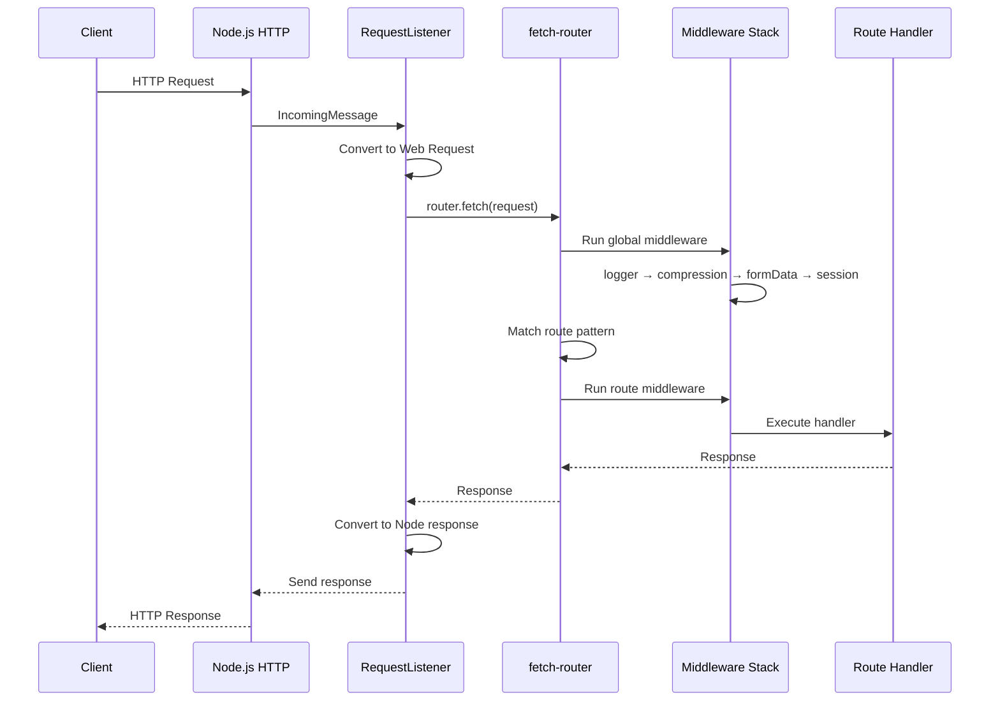

# Remix 3 Framework Deep Analysis

**Version Analyzed:** Remix 3 (monorepo: `remix-the-web`) **Analysis Date:**
December 2025 **Runtime Requirements:** Node.js >= 22, pnpm 10.26.0 **TypeScript
Version:** 5.9.3

---

## Executive Summary

Remix 3 represents a complete architectural redesign of the Remix framework.
Unlike Remix v1/v2, which built on React Router with Vite integration, Remix 3
is a collection of **24+ composable packages** built entirely on Web Standards.

### What Makes Remix 3 Different

| Aspect       | Remix v2             | Remix 3                   |
| ------------ | -------------------- | ------------------------- |
| Architecture | Monolithic framework | 24+ composable packages   |
| Build Tool   | Vite                 | tsgo + esbuild            |
| Routing      | React Router         | Custom fetch-router       |
| Standards    | Mixed Node.js/Web    | Web APIs exclusively      |
| Runtime      | Node.js primary      | Node, Bun, Deno, Workers  |
| HMR          | Vite HMR             | File watching (tsx watch) |
| React        | React 18+ with RSC   | Custom JSX runtime        |

### Core Philosophy

Remix 3 follows six design principles:

1. **Model-First Development** - Optimize code and documentation for LLMs and AI
   workflows
2. **Build on Web APIs** - Use Fetch, Streams, Web Crypto instead of
   Node-specific APIs
3. **Religiously Runtime** - No build-time magic; all tests run without bundling
4. **Avoid Dependencies** - Goal is zero external dependencies
5. **Demand Composition** - Single-purpose, replaceable packages
6. **Distribute Cohesively** - Ship as unified `remix` package despite modular
   internals

### Key Takeaways

- **Portable by default**: Same code runs on Node.js, Bun, Deno, and Cloudflare
  Workers
- **No Vite**: Intentional omission for runtime-first design
- **No React Server Components**: Custom hydration via `hydrated()` function
- **Type-safe routing**: Full TypeScript inference for routes and parameters
- **Middleware-centric**: Koa-style composable middleware for all concerns

---

## Core Architecture & Runtime Dynamics

### Package Organization

Remix 3 is organized as a pnpm monorepo with 24 packages under the
`@remix-run/*` namespace:

```
packages/
├── Core HTTP Stack
│   ├── node-fetch-server     # Node.js server using Fetch API
│   ├── fetch-router          # Minimal, composable router
│   ├── headers               # HTTP header utilities
│   └── response              # Response builders (compress, file, html, redirect)
│
├── Data & Forms
│   ├── form-data-parser      # FormData with streaming uploads
│   ├── multipart-parser      # Low-level multipart stream parser
│   └── form-data-middleware  # FormData middleware
│
├── State Management
│   ├── cookie                # Cookie handling with signing
│   ├── session               # Session management (3 backends)
│   ├── session-middleware    # Session middleware
│   └── file-storage          # Key/value storage for Files
│
├── Utilities
│   ├── route-pattern         # URL pattern matching with types
│   ├── html-template         # Safe HTML templating
│   ├── mime                  # MIME type utilities
│   ├── lazy-file             # Streaming file abstractions
│   ├── fs                    # Filesystem via Web File API
│   ├── fetch-proxy           # HTTP proxy
│   └── tar-parser            # TAR archive parsing
│
├── Middleware
│   ├── compression-middleware    # Response compression
│   ├── logger-middleware         # Request/response logging
│   ├── async-context-middleware  # AsyncLocalStorage wrapper
│   ├── method-override-middleware # HTTP method override
│   └── static-middleware         # Static file serving
│
└── UI/Client
    └── interaction           # Event-based interactions
```

### Package Dependency Graph



### Entry Point Pattern

All packages follow a consistent structure:

```
@remix-run/{package}/
├── src/
│   ├── index.ts          # Main exports
│   ├── lib/              # Implementation
│   └── **/*.test.ts      # Co-located tests
├── dist/                 # Built output (ESM + types)
├── package.json
├── tsconfig.json
└── tsconfig.build.json
```

Package exports configuration:

```json
{
  "exports": {
    ".": {
      "types": "./dist/index.d.ts",
      "default": "./dist/index.js"
    }
  },
  "devExports": {
    ".": "./src/index.ts"
  }
}
```

### Application Initialization Flow



### Request Listener Implementation

The `node-fetch-server` package bridges Node.js HTTP to Fetch API:

```typescript
// packages/node-fetch-server/src/lib/request-listener.ts

export function createRequestListener(
  handler: FetchHandler,
  options?: RequestListenerOptions,
): RequestListener {
  return async (req, res) => {
    // Create AbortController for request lifecycle
    let controller = new AbortController();
    res.on("close", () => controller.abort());

    // Convert Node request to Web Request
    let request = createRequest(req, {
      signal: controller.signal,
      // Derive URL from headers
      getURL: options?.getURL ?? defaultGetURL,
    });

    try {
      let response = await handler(request);
      await sendResponse(res, response);
    } catch (error) {
      // Error handler or 500
      let errorResponse = options?.onError?.(error) ??
        new Response("Internal Server Error", { status: 500 });
      await sendResponse(res, errorResponse);
    }
  };
}
```

### Router Architecture

The `fetch-router` creates a router implementing the Fetch API:

```typescript
// packages/fetch-router/src/lib/router.ts

export function createRouter(options?: RouterOptions): Router {
  let globalMiddleware = options?.middleware ?? [];
  let routes: RouteEntry[] = [];
  let matcher = new TrieMatcher(); // Efficient O(log n) matching

  return {
    // Core fetch handler
    async fetch(request: Request): Promise<Response> {
      let url = new URL(request.url);
      let method = request.method as RequestMethod;

      // Create request context
      let context = createRequestContext(request);

      // Run global middleware
      return runMiddleware(globalMiddleware, context, async () => {
        // Find matching route
        let match = matcher.match(url, method);
        if (!match) {
          return new Response("Not Found", { status: 404 });
        }

        // Extract params
        context.params = match.params;

        // Run route middleware + handler
        let routeMiddleware = match.middleware ?? [];
        return runMiddleware(routeMiddleware, context, match.handler);
      });
    },

    // Route registration methods
    get(pattern, handler) {/* ... */},
    post(pattern, handler) {/* ... */},
    put(pattern, handler) {/* ... */},
    delete(pattern, handler) {/* ... */},

    // Map routes to handlers
    map(routes, handlers) {/* ... */},
  };
}
```

### Request Context

Every handler receives a typed `RequestContext`:

```typescript
// packages/fetch-router/src/lib/request-context.ts

interface RequestContext<
  method extends RequestMethod,
  params extends Record<string, string>,
> {
  request: Request; // Original Web Request
  method: method; // HTTP method (may differ from request.method)
  params: params; // URL parameters from route pattern
  url: URL; // Parsed URL object
  headers: SuperHeaders; // Enhanced Headers API
  formData: FormData; // Lazy-parsed form data
  files: Map<string, File>; // Uploaded files
  session: Session; // Session data (via middleware)
  sessionStarted: boolean; // Whether session middleware ran
  storage: AppStorage; // Shared application state
}
```

---

## Build System & Bundling

### Build Tool Stack

Remix 3 intentionally avoids complex build tooling:

| Tool             | Purpose                     | Used For                |
| ---------------- | --------------------------- | ----------------------- |
| `tsgo`           | TypeScript compiler wrapper | All packages            |
| `esbuild`        | Fast bundler                | Client-side assets only |
| `tsx`            | TypeScript executor         | Dev server, tests       |
| Node test runner | Testing                     | All packages            |

### Why No Vite?

From the "Religiously Runtime" principle:

> "Designing for bundlers/compilers/typegen (and any pre-runtime static
> analysis) leads to poor API design that eventually pollutes the entire
> system."

This means:

- All tests run directly from TypeScript source
- No build step required for development
- No Vite plugins, no special imports, no magic
- Code works identically in dev and production

### TypeScript Configuration

Base configuration used by all packages:

```json
// packages/*/tsconfig.json
{
  "compilerOptions": {
    "strict": true,
    "lib": ["ES2024", "DOM", "DOM.Iterable"],
    "module": "ES2022",
    "moduleResolution": "Bundler",
    "target": "ESNext",
    "allowImportingTsExtensions": true,
    "rewriteRelativeImportExtensions": true,
    "verbatimModuleSyntax": true,
    "skipLibCheck": true
  }
}
```

Build configuration:

```json
// packages/*/tsconfig.build.json
{
  "extends": "./tsconfig.json",
  "compilerOptions": {
    "declaration": true,
    "declarationMap": true,
    "noEmit": false,
    "outDir": "./dist",
    "sourceMap": true
  },
  "include": ["src"],
  "exclude": ["src/**/*.test.ts"]
}
```

### Client-Side Bundling with esbuild

For browser assets, esbuild handles bundling:

```bash
# From demos/bookstore/package.json
esbuild app/assets/*.tsx \
  --outbase=app/assets \
  --outdir=public/assets \
  --bundle \
  --minify \
  --splitting \
  --format=esm \
  --entry-names='[dir]/[name]' \
  --chunk-names='chunks/[name]-[hash]' \
  --sourcemap \
  --watch
```

Features enabled:

- **Code Splitting**: `--splitting` extracts shared code into chunks
- **Tree Shaking**: Dead code elimination via ESM
- **Minification**: `--minify` for production builds
- **Source Maps**: `--sourcemap` for debugging
- **Hash-based Caching**: `--chunk-names='chunks/[name]-[hash]'`

### CSS Processing

Remix 3 takes a minimalist approach to CSS:

**1. Inline Styles (Primary Pattern)**

```tsx
// demos/bookstore/app/layout.tsx
export function Document({ children }: { children: Remix.RemixNode }) {
  return (
    <html lang="en">
      <head>
        <style>
          {`
          * { box-sizing: border-box; margin: 0; padding: 0; }
          body { font-family: system-ui, sans-serif; }
          /* ... */
        `}
        </style>
      </head>
      <body>{children}</body>
    </html>
  );
}
```

**2. CSS-in-JS via `css` Prop**

```tsx
<div
  css={{
    display: "flex",
    gap: "0.5rem",
    backgroundColor: "#f5f5f5",
  }}
>
  Content
</div>;
```

**3. Static Files**

CSS files in `public/` served via `static-middleware`:

```typescript
router.use(staticFiles("./public", {
  cacheControl: "public, max-age=31536000",
  etag: true,
}));
```

No CSS Modules, no PostCSS, no Tailwind by default - keeping with the "avoid
dependencies" principle.

### Build Scripts

```json
// Root package.json scripts
{
  "scripts": {
    "build": "pnpm -r build",           // Build all packages
    "test": "pnpm --parallel run test", // Test all packages
    "typecheck": "pnpm -r typecheck",   // Type check all packages
    "clean": "git clean -fdX -e '!/.env' ."
  }
}

// Individual package scripts
{
  "scripts": {
    "build": "tsgo -p tsconfig.build.json",
    "test": "node --test src/**/*.test.ts",
    "typecheck": "tsgo --noEmit"
  }
}
```

---

## Performance Optimizations

### Rendering Strategy

Remix 3 uses **server-side rendering with selective hydration**:


**Server-Side Rendering:**

```typescript
// Server renders complete HTML
import { renderToStream } from "@remix-run/dom/server";

function render(element: Remix.RemixElement, init?: ResponseInit) {
  return createHtmlResponse(renderToStream(element), init);
}

// Handler returns fully rendered response
router.map(routes.home, async (context) => {
  let data = await loadData();
  return render(<HomePage data={data} />);
});
```

**Selective Hydration:**

```typescript
// Only interactive components hydrate on client
export const CartButton = hydrated(
  routes.assets.href({ path: "cart-button.js#CartButton" }),
  function (this: Remix.Handle) {
    return ({ inCart, id }) => (
      <form method="post" action={action}>
        <button type="submit">
          {inCart ? "Remove" : "Add to Cart"}
        </button>
      </form>
    );
  },
);
```

### Frame System for Partial Updates

Instead of client-side routing, Remix 3 uses **Frames** for partial page
updates:

```tsx
// Server renders a fragment
router.map(routes.fragments.bookCard, async ({ params }) => {
  let book = await getBook(params.slug)
  return render(<BookCard book={book} />)
})

// Main page uses Frame component
<Frame
  fallback={<div>Loading...</div>}
  src={routes.fragments.bookCard.href({ slug: book.slug })}
/>

// Client can reload frames
await this.frame.reload()  // Re-fetches from server
```

Benefits:

- No client-side router bundle
- Server computes fresh data on each frame reload
- Progressive enhancement - works without JavaScript

### Code Splitting Strategy

```
public/assets/
├── entry.js              # Main entry (small)
├── cart-button.js        # Lazy loaded
├── image-carousel.js     # Lazy loaded
└── chunks/
    ├── shared-abc123.js  # Shared utilities
    └── vendor-def456.js  # Shared dependencies
```

Components load on-demand via dynamic imports:

```typescript
// createFrame handles module loading
createFrame(document, {
  async loadModule(moduleUrl, name) {
    let mod = await import(moduleUrl);
    return mod[name];
  },
});
```

### Streaming Responses

All packages use Web Streams for memory efficiency:

```typescript
// Response compression with streaming
export function compress(
  body: ReadableStream<Uint8Array>,
  encoding: "gzip" | "deflate" | "br",
): ReadableStream<Uint8Array> {
  let compressor = createCompressor(encoding);
  let reader = body.getReader();

  return new ReadableStream({
    async pull(controller) {
      let { done, value } = await reader.read();
      if (done) {
        compressor.end();
        controller.close();
        return;
      }
      let compressed = compressor.write(value);
      controller.enqueue(compressed);
    },
  });
}
```

### Multipart Parsing with Generators

File uploads stream through generators to avoid buffering:

```typescript
// packages/multipart-parser/src/lib/multipart.ts
export async function* parseMultipart(
  body: ReadableStream<Uint8Array>,
  boundary: string,
): AsyncGenerator<MultipartPart> {
  let reader = body.getReader();
  let buffer = new Uint8Array(0);

  while (true) {
    let { done, value } = await reader.read();
    if (done) break;

    buffer = concat(buffer, value);

    // Yield complete parts as they're parsed
    while (hasCompletePart(buffer, boundary)) {
      let [part, remaining] = extractPart(buffer, boundary);
      buffer = remaining;
      yield part;
    }
  }
}
```

---

## Security Measures

### XSS Prevention

The `html-template` package provides automatic XSS protection:

```typescript
// packages/html-template/src/lib/safe-html.ts

// Branded type prevents accidental raw HTML
declare const kSafeHtml: unique symbol;
export type SafeHtml = string & { [kSafeHtml]: true };

// Escape map for HTML entities
const escapeMap: Record<string, string> = {
  "&": "&amp;",
  "<": "&lt;",
  ">": "&gt;",
  '"': "&quot;",
  "'": "&#39;",
};

function escapeHtml(str: string): string {
  return str.replace(/[&<>"']/g, (char) => escapeMap[char]);
}

// Template tag automatically escapes interpolations
export function html(
  strings: TemplateStringsArray,
  ...values: unknown[]
): SafeHtml {
  let result = strings[0];
  for (let i = 0; i < values.length; i++) {
    let value = values[i];
    if (isSafeHtml(value)) {
      result += value; // Already safe
    } else {
      result += escapeHtml(String(value)); // Escape!
    }
    result += strings[i + 1];
  }
  return result as SafeHtml;
}

// Explicit opt-in for trusted HTML
html.raw = function (
  strings: TemplateStringsArray,
  ...values: unknown[]
): SafeHtml {
  // No escaping - developer takes responsibility
};
```

Usage:

```typescript
// Safe - user input is escaped
let userInput = '<script>alert("XSS")</script>';
let safe = html`
  <div>${userInput}</div>
`;
// Result: <div>&lt;script&gt;alert("XSS")&lt;/script&gt;</div>

// Explicit raw when needed
let trusted = html.raw`<div>${sanitizedHtml}</div>`;
```

### Cookie Security

Cookies support full security configuration:

```typescript
// packages/cookie/src/lib/cookie.ts

interface CookieOptions {
  domain?: string;
  path?: string; // Default: '/'
  maxAge?: number;
  expires?: Date;
  httpOnly?: boolean; // Default: false (set true for session cookies)
  secure?: boolean; // Default: false (auto-true when sameSite='None')
  sameSite?: "Strict" | "Lax" | "None"; // Default: 'Lax'
  partitioned?: boolean; // CHIPS support
}
```

**Cookie Signing with HMAC-SHA256:**

```typescript
// packages/cookie/src/lib/cookie-signing.ts

export async function sign(value: string, secret: string): Promise<string> {
  let data = encoder.encode(value);
  let key = await crypto.subtle.importKey(
    "raw",
    encoder.encode(secret),
    { name: "HMAC", hash: "SHA-256" },
    false,
    ["sign"],
  );
  let signature = await crypto.subtle.sign("HMAC", key, data);
  let hash = btoa(String.fromCharCode(...new Uint8Array(signature)));
  return `${value}.${hash}`;
}

export async function unsign(
  cookie: string,
  secrets: string[], // Support rotation
): Promise<string | false> {
  let [value, hash] = cookie.split(".");

  for (let secret of secrets) {
    let key = await crypto.subtle.importKey(); /* ... */
    let signature = Uint8Array.from(atob(hash), (c) => c.charCodeAt(0));
    let data = encoder.encode(value);

    // Constant-time verification
    let valid = await crypto.subtle.verify("HMAC", key, signature, data);
    if (valid) return value;
  }

  return false;
}
```

### Session Management

Sessions use cryptographically secure IDs:

```typescript
// packages/session/src/lib/session.ts

export function createSessionId(): string {
  return crypto.randomUUID(); // Cryptographically secure
}

export class Session {
  #currentId: string;
  #originalId: string | undefined;
  #destroyed = false;
  #dirty = false;

  // Regenerate ID after privilege changes (login)
  regenerateId(deleteOldSession = false): void {
    if (deleteOldSession) this.#deleteId = this.#originalId;
    this.#currentId = createSessionId();
    this.#dirty = true;
  }

  // Destroy session (logout)
  destroy(): void {
    this.#destroyed = true;
    this.#deleteId = this.#currentId;
  }

  // Guard against use-after-destroy
  #checkDestroyed() {
    if (this.#destroyed) throw new Error("Session has been destroyed");
  }
}
```

**Storage Backends:**

| Backend    | Use Case                   | Persistence           |
| ---------- | -------------------------- | --------------------- |
| Cookie     | Stateless, small data      | Client-side           |
| FileSystem | Development, single server | Disk                  |
| Memory     | Testing only               | RAM (lost on restart) |

### Input Validation

File uploads have configurable limits:

```typescript
// packages/form-data-parser/src/lib/form-data.ts

interface ParseFormDataOptions {
  maxFiles?: number; // Default: 20
  maxFileSize?: number; // Default: 2MB (2097152 bytes)
  maxHeaderSize?: number; // Default: 8KB (8192 bytes)
  uploadHandler?: (file: File) => Promise<File | null>;
}

// Custom error classes for specific failures
export class FormDataParseError extends Error {}
export class MaxFilesExceededError extends FormDataParseError {
  constructor(maxFiles: number) {
    super(`Maximum number of files (${maxFiles}) exceeded`);
  }
}
export class MaxFileSizeExceededError extends FormDataParseError {
  constructor(maxFileSize: number) {
    super(`Maximum file size (${maxFileSize} bytes) exceeded`);
  }
}
```

### Security Defaults Summary

| Feature           | Default   | Recommendation                          |
| ----------------- | --------- | --------------------------------------- |
| Cookie httpOnly   | `false`   | Set `true` for session cookies          |
| Cookie secure     | `false`   | Set `true` in production                |
| Cookie sameSite   | `'Lax'`   | Keep default or use `'Strict'`          |
| HTML escaping     | Automatic | Use `html.raw` only for trusted content |
| Session IDs       | UUID v4   | No changes needed                       |
| File upload limit | 2MB       | Adjust based on use case                |
| Max files         | 20        | Adjust based on use case                |

---

## Framework Features

### Routing System

The `fetch-router` provides type-safe routing:

```typescript
// packages/fetch-router/src/lib/route-map.ts

import { form, get, post, resources, route } from "@remix-run/fetch-router";

// Define routes with full type inference
export let routes = route({
  // Simple routes
  home: "/",
  about: "/about",

  // Dynamic segments
  posts: {
    index: "/posts",
    show: "/posts/:slug",
    category: "/posts/category/:category",
  },

  // Form routes (GET + POST)
  contact: form("contact"),
  login: form("login"),

  // Resource routes (CRUD)
  books: resources("books", {
    only: ["index", "show", "new", "create"],
    param: "bookId",
  }),

  // Nested routes
  admin: route("admin", {
    dashboard: "/",
    users: resources("users"),
    settings: form("settings", { formMethod: "PUT" }),
  }),

  // Wildcards
  assets: "/assets/*path",
  files: "/files/*filepath",
});
```

**Generated Routes:**

| Helper               | Pattern                                    | Methods                |
| -------------------- | ------------------------------------------ | ---------------------- |
| `form('login')`      | `/login`                                   | GET, POST              |
| `resources('books')` | `/books`, `/books/new`, `/books/:id`, etc. | GET, POST, PUT, DELETE |
| `get('about')`       | `/about`                                   | GET                    |
| `post('logout')`     | `/logout`                                  | POST                   |

**Type-Safe URL Generation:**

```typescript
// Full type inference for params
routes.posts.show.href({ slug: "hello-world" });
// => '/posts/hello-world'

routes.admin.users.show.href({ id: "123" });
// => '/admin/users/123'

// TypeScript error if params missing
routes.posts.show.href({}); // Error: Property 'slug' is missing
```

### Route Pattern Matching

The `route-pattern` package provides efficient URL matching:

```typescript
// packages/route-pattern/src/lib/route-pattern.ts

// Pattern syntax
"/posts/:slug"; // Required param
"/posts/:slug?"; // Optional param (not supported - use optional groups)
"/posts(/:slug)"; // Optional segment
"/files/*path"; // Wildcard (captures rest of path)
"/api(/v1)(/v2)"; // Optional literal segments

// Pattern compilation
let pattern = new RoutePattern("/posts/:slug");
let match = pattern.match("/posts/hello-world");
// => { slug: 'hello-world' }

// No match
pattern.match("/users/123");
// => null
```

**Trie-Based Matcher:**

For applications with many routes, a trie provides O(log n) matching:

```typescript
// packages/route-pattern/src/lib/matchers/trie.ts

class TrieMatcher {
  #root = new TrieNode();

  add(pattern: string, handler: Handler): void {
    let segments = pattern.split("/");
    let node = this.#root;

    for (let segment of segments) {
      if (segment.startsWith(":")) {
        // Parameter segment
        node = node.getOrCreateParam(segment.slice(1));
      } else if (segment === "*") {
        // Wildcard
        node = node.getOrCreateWildcard();
      } else {
        // Static segment
        node = node.getOrCreateStatic(segment);
      }
    }

    node.handler = handler;
  }

  match(url: URL, method: string): Match | null {
    // Best-first traversal with specificity scoring
    // Static > Param > Wildcard
  }
}
```

### Middleware System

Koa-style middleware with `next()` function:

```typescript
// packages/fetch-router/src/lib/middleware.ts

type Middleware<method, params> = (
  context: RequestContext<method, params>,
  next: () => Promise<Response>,
) => Response | void | Promise<Response | void>;

// Middleware execution
export async function runMiddleware(
  middleware: Middleware[],
  context: RequestContext,
  handler: Handler,
): Promise<Response> {
  let index = -1;

  async function dispatch(i: number): Promise<Response> {
    if (i <= index) throw new Error("next() called multiple times");
    index = i;

    let fn = middleware[i];
    if (!fn) return handler(context);

    let response = await fn(context, () => dispatch(i + 1));
    if (response) return response;
    return dispatch(i + 1);
  }

  return dispatch(0);
}
```

**Built-in Middleware:**

```typescript
import { createRouter } from "@remix-run/fetch-router";
import { compression } from "@remix-run/compression-middleware";
import { formData } from "@remix-run/form-data-middleware";
import { logger } from "@remix-run/logger-middleware";
import { session } from "@remix-run/session-middleware";
import { staticFiles } from "@remix-run/static-middleware";
import { methodOverride } from "@remix-run/method-override-middleware";
import { asyncContext } from "@remix-run/async-context-middleware";

let router = createRouter({
  middleware: [
    logger(), // Log requests/responses
    compression(), // Gzip/Brotli responses
    staticFiles("./public"), // Serve static files
    formData(), // Parse form submissions
    methodOverride(), // Support PUT/DELETE from forms
    session(cookie, storage), // Session management
    asyncContext(), // Request-scoped context
  ],
});
```

### Form Handling

Forms use progressive enhancement:

```typescript
// Server: Define form route
let routes = route({
  contact: form("contact"), // GET + POST
});

// Handler
router.map(routes.contact, {
  // GET: Show form
  async get(context) {
    return render(<ContactForm />);
  },

  // POST: Process submission
  async post(context) {
    let data = await context.formData;
    let name = data.get("name");
    let email = data.get("email");

    await sendEmail({ name, email });

    return redirect(routes.contact.href(), {
      headers: { "X-Flash": "Message sent!" },
    });
  },
});
```

**Method Override for PUT/DELETE:**

HTML forms only support GET/POST. The `method-override-middleware` enables:

```html
<form method="post" action="/books/123">
  <input type="hidden" name="_method" value="DELETE">
  <button type="submit">Delete Book</button>
</form>
```

```typescript
// Middleware converts POST with _method=DELETE to DELETE
router.use(methodOverride());
```

### File Uploads

Streaming file upload handling:

```typescript
import { formData } from "@remix-run/form-data-middleware";

router.use(formData({
  maxFiles: 10,
  maxFileSize: 5 * 1024 * 1024, // 5MB

  // Custom upload handler
  async uploadHandler(file) {
    // Stream to cloud storage
    let key = `uploads/${crypto.randomUUID()}-${file.name}`;
    await uploadToS3(key, file.stream());

    // Return reference instead of file data
    return new File([], file.name, {
      type: file.type,
      // Store reference in file metadata
    });
  },
}));
```

---

## DOM Integration

### JSX Runtime

Remix 3 provides its own JSX runtime via `@remix-run/dom`:

```json
// tsconfig.json
{
  "compilerOptions": {
    "jsx": "react-jsx",
    "jsxImportSource": "@remix-run/dom"
  }
}
```

**Server Rendering:**

```typescript
import { renderToStream } from "@remix-run/dom/server";
import { createHtmlResponse } from "@remix-run/response/html";

function render(element: Remix.RemixElement): Response {
  return createHtmlResponse(renderToStream(element));
}
```

### Hydration System

Components that need client-side behavior use `hydrated()`:

```typescript
// app/assets/cart-button.tsx
import { hydrated, type Remix } from "@remix-run/dom";
import { dom } from "@remix-run/events";

interface Props {
  inCart: boolean;
  bookId: string;
}

export const CartButton = hydrated(
  // Module URL for lazy loading
  routes.assets.href({ path: "cart-button.js#CartButton" }),
  // Component factory
  function (this: Remix.Handle) {
    let updating = false;

    return ({ inCart, bookId }: Props) => {
      let action = inCart ? routes.cart.remove.href() : routes.cart.add.href();

      return (
        <form
          method="post"
          action={action}
          on={dom.submit(async (event, signal) => {
            event.preventDefault();
            updating = true;
            this.update(); // Re-render

            await fetch(action, {
              method: "POST",
              body: new FormData(event.currentTarget),
              signal,
            });

            await this.frame.reload(); // Reload parent frame
            updating = false;
            this.update();
          })}
        >
          <input type="hidden" name="bookId" value={bookId} />
          <button type="submit" disabled={updating}>
            {updating ? "Updating..." : inCart ? "Remove" : "Add"}
          </button>
        </form>
      );
    };
  },
);
```

**Handle Interface:**

```typescript
interface Remix.Handle {
  update(): void              // Trigger re-render
  queueTask(fn: () => void)   // Run after render
  signal: AbortSignal         // For cleanup
  frame: {
    reload(): Promise<void>   // Reload frame from server
  }
}
```

### Event Handling

The `@remix-run/interaction` package provides semantic events:

```typescript
// packages/interaction/src/lib/on.ts

import { on } from "@remix-run/interaction";
import { longPress, press } from "@remix-run/interaction/press";
import { enter, escape } from "@remix-run/interaction/keys";

// Basic event handling
on(button, {
  click() {
    console.log("clicked");
  },
});

// Async with automatic abort
on(input, {
  async input(event, signal) {
    let results = await fetch(`/search?q=${event.target.value}`, { signal });
    // If another input event fires, previous fetch is aborted
    updateResults(await results.json());
  },
});

// Semantic interactions
on(button, {
  [press]() {
    // Normalized pointer/keyboard press
  },
  [longPress]() {
    // 500ms+ press
  },
});

// Keyboard shortcuts
on(document, {
  [escape]() {
    closeModal();
  },
  [enter]() {
    submit();
  },
});
```

**JSX Integration via `@remix-run/events`:**

```tsx
import { dom } from '@remix-run/events'
import { press } from '@remix-run/interaction/press'

<button on={dom.click(() => doSomething())}>
  Click Me
</button>

<button on={press(() => doSomething())}>
  Press Me
</button>

<form on={dom.submit(async (event, signal) => {
  event.preventDefault()
  await submitForm(event.currentTarget, signal)
})}>
  {/* ... */}
</form>
```

### Frame System

Frames enable partial page updates without client-side routing:

```typescript
// Client entry point
import { createFrame } from "@remix-run/dom";

createFrame(document, {
  // Load component modules
  async loadModule(moduleUrl, name) {
    let mod = await import(moduleUrl);
    return mod[name];
  },

  // Fetch frame content from server
  async resolveFrame(frameUrl) {
    let res = await fetch(frameUrl);
    if (res.ok) return res.text();
    throw new Error(`Failed to fetch ${frameUrl}`);
  },
});
```

**Using Frames:**

```tsx
// Server route returns fragment
router.map(routes.fragments.productCard, async ({ params }) => {
  let product = await getProduct(params.id)
  return render(<ProductCard product={product} />)
})

// Parent page uses Frame component
<div class="product-grid">
  {products.map(p => (
    <Frame
      key={p.id}
      fallback={<ProductSkeleton />}
      src={routes.fragments.productCard.href({ id: p.id })}
    />
  ))}
</div>
```

---

## Developer Experience

### CLI Tools and Scripts

```bash
# Development
pnpm dev              # Start dev server with tsx watch
pnpm dev:browser      # Start esbuild in watch mode

# Testing
pnpm test             # Run all tests (node --test)
pnpm test --watch     # Watch mode

# Building
pnpm build            # Build all packages
pnpm typecheck        # Type check without emit

# Linting
pnpm lint             # ESLint
pnpm lint:fix         # Auto-fix issues
```

### Dev Server Setup

```typescript
// server.ts
import * as http from "node:http";
import { createRequestListener } from "@remix-run/node-fetch-server";
import { router } from "./app/router.ts";

let server = http.createServer(
  createRequestListener(async (request) => {
    try {
      return await router.fetch(request);
    } catch (error) {
      console.error(error);
      return new Response("Internal Server Error", { status: 500 });
    }
  }),
);

let port = process.env.PORT ?? 3000;
server.listen(port, () => {
  console.log(`Server running on http://localhost:${port}`);
});
```

Run with:

```bash
NODE_ENV=development tsx watch server.ts
```

### Testing

Tests run directly from TypeScript source:

```typescript
// packages/headers/src/lib/cache-control.test.ts
import { test } from "node:test";
import * as assert from "node:assert/strict";
import { CacheControl } from "./cache-control.ts";

test("CacheControl parses max-age", () => {
  let cc = new CacheControl("max-age=3600");
  assert.equal(cc.maxAge, 3600);
});

test("CacheControl serializes correctly", () => {
  let cc = new CacheControl();
  cc.public = true;
  cc.maxAge = 86400;
  assert.equal(cc.toString(), "public, max-age=86400");
});
```

Run tests:

```bash
# All tests
pnpm test

# Specific package
pnpm --filter @remix-run/headers test

# With debugging
node --inspect --test src/**/*.test.ts
```

### Debugging

Source maps enable breakpoint debugging:

1. Tests run from source - no build required
2. `sourceMap: true` in build config
3. VS Code `node:test runner` extension recommended

```json
// .vscode/launch.json
{
  "type": "node",
  "request": "launch",
  "name": "Debug Tests",
  "program": "${workspaceFolder}/node_modules/.bin/tsx",
  "args": ["--test", "${file}"],
  "console": "integratedTerminal"
}
```

### Logger Middleware

Request/response logging in development:

```typescript
import { logger } from "@remix-run/logger-middleware";

router.use(logger({
  // Log format
  format: ":method :url :status :response-time ms",
}));

// Output:
// GET /posts/hello-world 200 45ms
// POST /contact 302 123ms
```

---

## Glossary

| Term                  | Definition                                                                |
| --------------------- | ------------------------------------------------------------------------- |
| **SafeHtml**          | Branded string type that marks content as safe for HTML rendering         |
| **RequestContext**    | Object containing request, params, session, and other request-scoped data |
| **Middleware**        | Function that intercepts requests/responses in the router pipeline        |
| **Frame**             | Partial page section that can be independently loaded/reloaded            |
| **hydrated()**        | Function that marks a component for client-side hydration                 |
| **RoutePattern**      | URL pattern with typed parameters (e.g., `/posts/:slug`)                  |
| **TrieMatcher**       | Efficient data structure for route matching in O(log n) time              |
| **Web Streams**       | Standard API for streaming data (ReadableStream, WritableStream)          |
| **CHIPS**             | Cookies Having Independent Partitioned State - privacy feature            |
| **AsyncLocalStorage** | Node.js API for request-scoped context (used by async-context-middleware) |

---

## Appendix: Key File Locations

| Category           | File Path                                                |
| ------------------ | -------------------------------------------------------- |
| Router Core        | `packages/fetch-router/src/lib/router.ts`                |
| Route Patterns     | `packages/route-pattern/src/lib/route-pattern.ts`        |
| Trie Matcher       | `packages/route-pattern/src/lib/matchers/trie.ts`        |
| Request Listener   | `packages/node-fetch-server/src/lib/request-listener.ts` |
| Middleware         | `packages/fetch-router/src/lib/middleware.ts`            |
| XSS Prevention     | `packages/html-template/src/lib/safe-html.ts`            |
| Cookie Signing     | `packages/cookie/src/lib/cookie-signing.ts`              |
| Session            | `packages/session/src/lib/session.ts`                    |
| Form Data Parser   | `packages/form-data-parser/src/lib/form-data.ts`         |
| Multipart Parser   | `packages/multipart-parser/src/lib/multipart.ts`         |
| Interaction Events | `packages/interaction/src/lib/on.ts`                     |
| Demo App           | `demos/bookstore/`                                       |

---

_Generated by Claude Code - December 2025_
