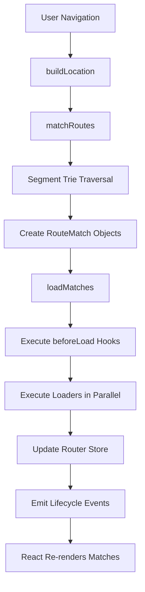
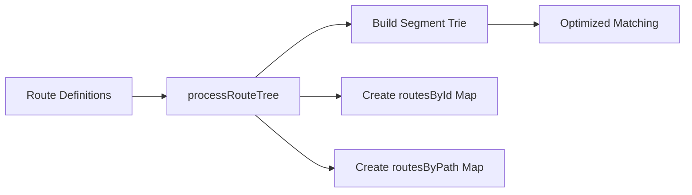
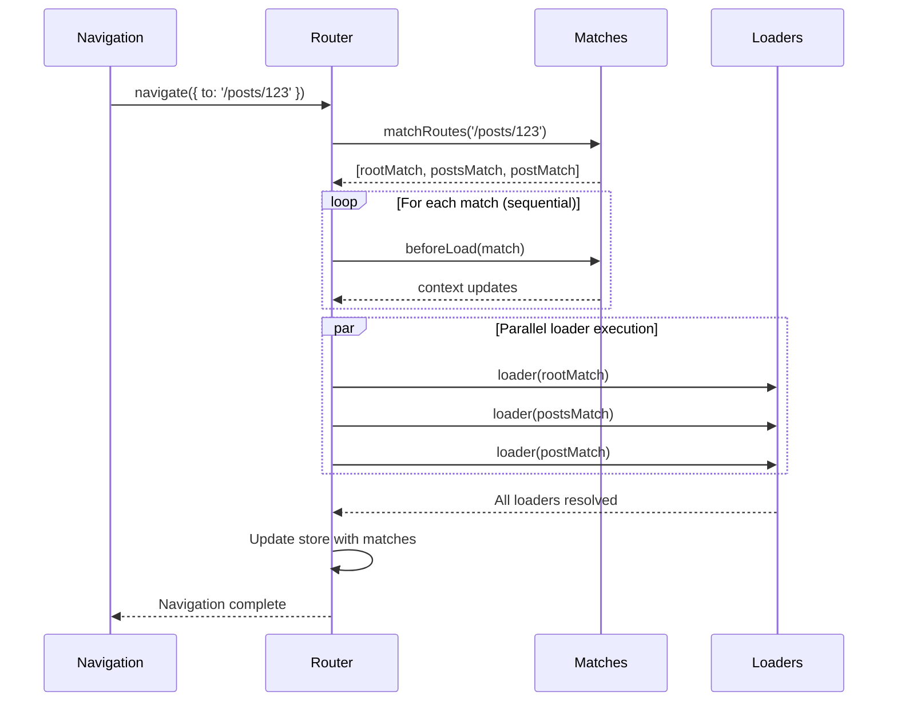
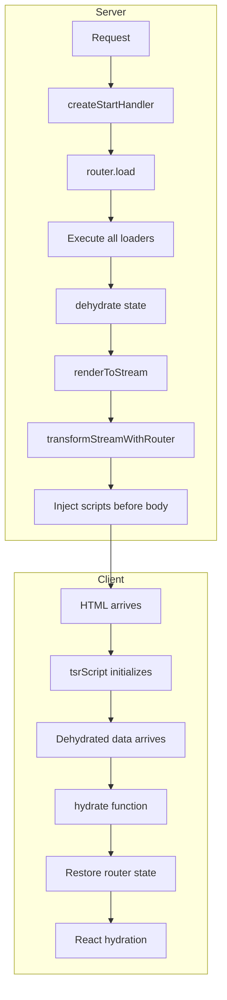
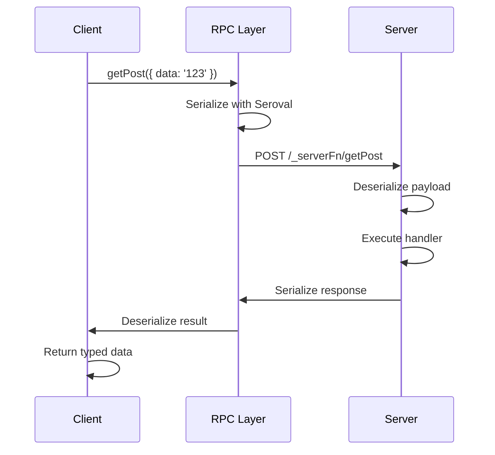

# TanStack Router Deep Analysis

**Version Analyzed:** 1.141.5 **Repository:** https://github.com/TanStack/router
**License:** MIT **Author:** Tanner Linsley **Analysis Date:** December 2024

---

## Executive Summary

TanStack Router is a modern, type-safe routing solution for building full-stack
web applications. Unlike traditional routers that treat routing as a simple
URL-to-component mapping, TanStack Router provides a comprehensive data
management layer with built-in caching, prefetching, and server-side rendering
capabilities.

**Key Differentiators:**

- **Type Safety First**: Full TypeScript integration with automatic route
  parameter inference
- **Framework Agnostic Core**: Single `router-core` package with adapters for
  React, Solid, and Vue
- **Integrated Data Loading**: Loaders and actions built into the routing layer
- **Full-Stack Extension**: TanStack Start provides server functions, RPC, and
  production deployment
- **Modern Build Integration**: First-class Vite support with automatic code
  splitting

**Architecture at a Glance:**

| Component                                      | Purpose                                      |
| ---------------------------------------------- | -------------------------------------------- |
| `router-core`                                  | Framework-agnostic routing engine            |
| `react-router` / `solid-router` / `vue-router` | Framework adapters                           |
| `router-plugin`                                | Vite/Webpack/Rspack build integration        |
| `router-generator`                             | File-based route generation                  |
| `react-start`                                  | Full-stack framework (SSR, server functions) |

**Monorepo Statistics:**

- 43 packages in `packages/` directory
- Built with pnpm workspaces + NX for task orchestration
- TypeScript 5.9 with backwards compatibility testing (5.4-5.8)

---

## Table of Contents

1. [Architecture Overview](#1-architecture-overview)
2. [Build System & Bundling](#2-build-system--bundling)
3. [Routing Mechanism](#3-routing-mechanism)
4. [Data Loading Patterns](#4-data-loading-patterns)
5. [Server-Side Rendering & Hydration](#5-server-side-rendering--hydration)
6. [Performance Optimizations](#6-performance-optimizations)
7. [Security Measures](#7-security-measures)
8. [React Integration](#8-react-integration)
9. [TanStack Start (Full-Stack)](#9-tanstack-start-full-stack)
10. [Developer Experience](#10-developer-experience)
11. [Glossary](#11-glossary)

---

## 1. Architecture Overview

### Core Class Hierarchy

```
RouterCore (packages/router-core/src/router.ts)
├── Manages route tree and state
├── Handles navigation and history
├── Orchestrates data loading
└── Emits lifecycle events

BaseRoute (packages/router-core/src/route.ts)
├── Defines route configuration
├── Holds component references
├── Contains loader/beforeLoad hooks
└── Manages route-specific context

RouteMatch (runtime representation)
├── Matched route instance
├── Extracted parameters
├── Loader data and status
└── Error/notFound state
```

### Data Flow Diagram



### State Management

TanStack Router uses `@tanstack/store` for reactive state management:

```typescript
interface RouterState {
  status: "pending" | "idle";
  isLoading: boolean;
  isTransitioning: boolean;
  matches: Array<RouteMatch>;
  pendingMatches?: Array<RouteMatch>;
  cachedMatches: Array<RouteMatch>;
  location: ParsedLocation;
  resolvedLocation?: ParsedLocation;
  statusCode: number;
  redirect?: AnyRedirect;
}
```

**Key Files:**

- `packages/router-core/src/router.ts` (2819 lines) - Main router implementation
- `packages/router-core/src/route.ts` - Route class definition
- `packages/router-core/src/new-process-route-tree.ts` - Route tree processing

---

## 2. Build System & Bundling

### Tooling Stack

| Tool       | Version | Purpose                             |
| ---------- | ------- | ----------------------------------- |
| Vite       | 7.1.7   | Primary bundler and dev server      |
| NX         | 22.1.3  | Monorepo task orchestration         |
| pnpm       | 10.24.0 | Package management with workspaces  |
| TypeScript | 5.9.0   | Type checking (with 5.4-5.8 compat) |
| unplugin   | 2.1.2   | Cross-bundler plugin abstraction    |

### Build Configuration

Each package uses a standardized Vite configuration via `@tanstack/config/vite`:

```typescript
// packages/router-core/vite.config.ts
import { tanstackViteConfig } from "@tanstack/config/vite";

export default mergeConfig(
  config,
  tanstackViteConfig({
    entry: ["./src/index.ts", "./src/ssr/client.ts", "./src/ssr/server.ts"],
    srcDir: "./src",
  }),
);
```

**Output Format:**

- ESM: `dist/esm/*.js` with `.d.ts` declarations
- CJS: `dist/cjs/*.cjs` with `.d.cts` declarations

### Cross-Bundler Support

The router plugin uses `unplugin` to support multiple bundlers from a single
codebase:

```typescript
// packages/router-plugin/src/core/router-composed-plugin.ts
export const TanStackRouterVite = createVitePlugin(unpluginFactory);
export const TanStackRouterWebpack = createWebpackPlugin(unpluginFactory);
export const TanStackRouterRspack = createRspackPlugin(unpluginFactory);
export const TanStackRouterEsbuild = createEsbuildPlugin(unpluginFactory);
```

### Code Splitting Architecture

TanStack Router implements **two-phase compilation** for automatic code
splitting:

**Phase 1: Reference File Transform**

Original route file:

```typescript
export const Route = createFileRoute("/posts")({
  loader: fetchPosts,
  component: PostsComponent,
});

const PostsComponent = () => {/* ... */};
```

Transformed to:

```typescript
const $$splitComponentImporter = () => import("file.tsx?tsr-split=component");

export const Route = createFileRoute("/posts")({
  loader: fetchPosts,
  component: lazyRouteComponent($$splitComponentImporter, "component"),
});
```

**Phase 2: Virtual File Generation**

The `?tsr-split=component` query triggers virtual module creation containing
only the extracted component.

**Grouping Strategies:**

| Strategy            | Groups                                                                         |
| ------------------- | ------------------------------------------------------------------------------ |
| Default             | `[component]`, `[errorComponent]`, `[notFoundComponent]`                       |
| Components Combined | `[loader]`, `[component, pendingComponent, errorComponent, notFoundComponent]` |
| All Combined        | `[loader, component, pendingComponent, notFoundComponent]`, `[errorComponent]` |

### HMR Implementation

Route-specific HMR preserves navigation state during development:

```typescript
if (import.meta.hot) {
  import.meta.hot.accept((newModule) => {
    if (Route && newModule?.Route) {
      handleRouteUpdate(Route, newModule.Route);
    }
  });
}
```

The `handleRouteUpdate` function:

1. Preserves internal route properties (`_path`, `_id`, `_fullPath`)
2. Updates router's `routesById` and `routesByPath` maps
3. Clears match caches
4. Triggers router invalidation if route is currently active

---

## 3. Routing Mechanism

### Hybrid Routing Model

TanStack Router supports both file-based and configuration-based routing:

**File-Based (via router-generator):**

```
src/routes/
├── __root.tsx          → Root layout
├── index.tsx           → /
├── about.tsx           → /about
├── posts/
│   ├── route.tsx       → /posts (layout)
│   ├── index.tsx       → /posts/
│   └── $postId.tsx     → /posts/:postId
```

**Configuration-Based:**

```typescript
const rootRoute = createRootRoute({ component: RootLayout });
const indexRoute = createRoute({
  getParentRoute: () => rootRoute,
  path: "/",
  component: Home,
});
const router = createRouter({ routeTree: rootRoute.addChildren([indexRoute]) });
```

### Segment-Based Trie Matching

Routes are compiled into a segment trie for efficient O(n) matching where n =
path segments:

```typescript
// Segment types (from new-process-route-tree.ts)
const SEGMENT_TYPE_PATHNAME = 0; // Static: /about
const SEGMENT_TYPE_PARAM = 1; // Dynamic: /$postId
const SEGMENT_TYPE_WILDCARD = 2; // Catch-all: /$
const SEGMENT_TYPE_OPTIONAL_PARAM = 3; // Optional: /{-$id}
```

**Matching Priority:**

1. Static segments (exact match)
2. Parameters with prefix (e.g., `/post-$id`)
3. Parameters (`/$id`)
4. Optional parameters (`/{-$id}`)
5. Wildcards (`/$`)

### Route Tree Processing



### URL Building and Parsing

```typescript
// Building a URL
const href = router.buildLocation({
  to: "/posts/$postId",
  params: { postId: "123" },
  search: { sort: "date" },
}).href; // → /posts/123?sort=date

// Parsing a URL
const location = router.parseLocation(historyLocation);
// → { pathname: '/posts/123', search: { sort: 'date' }, ... }
```

---

## 4. Data Loading Patterns

### Loader Architecture

Each route can define a `loader` function for data fetching:

```typescript
export const Route = createFileRoute("/posts/$postId")({
  loader: async ({ params, context, abortController }) => {
    const post = await fetchPost(params.postId, {
      signal: abortController.signal,
    });
    return { post };
  },
  component: PostComponent,
});

function PostComponent() {
  const { post } = Route.useLoaderData();
  return <article>{post.title}</article>;
}
```

### beforeLoad Hook

Runs before loaders, useful for authentication and context setup:

```typescript
export const Route = createFileRoute("/dashboard")({
  beforeLoad: async ({ context }) => {
    const user = await context.auth.getUser();
    if (!user) {
      throw redirect({ to: "/login" });
    }
    return { user }; // Merged into context for loaders
  },
  loader: async ({ context }) => {
    // context.user is available here
    return fetchDashboardData(context.user.id);
  },
});
```

### Loading Sequence



### Stale-While-Revalidate

TanStack Router implements SWR caching:

```typescript
const age = Date.now() - prevMatch.updatedAt;
const staleAge = preload ? preloadStaleTime : staleTime;

if (status === "success" && age <= staleAge) {
  return prevMatch; // Return cached immediately
}

// Revalidate in background
if (loaderShouldRunAsync) {
  runLoader(async); // Background fetch
}
```

**Configuration Options:**

- `staleTime`: How long data is considered fresh (default: 0)
- `preloadStaleTime`: Fresh duration for preloaded data (default: 30s)
- `gcTime`: How long to keep cached data after unmount

---

## 5. Server-Side Rendering & Hydration

### SSR Architecture



### Dehydration (Server)

State is serialized with compressed property names to minimize payload:

```typescript
// Compressed match properties
{
  i: match.id,           // id
  b: __beforeLoadContext, // beforeLoad context
  l: loaderData,         // loader data
  e: error,              // error
  u: updatedAt,          // timestamp
  s: status,             // status
  ssr: ssrMode           // SSR mode
}
```

### Streaming Support

HTML streams through `transformStreamWithRouter()` which:

1. Buffers router scripts during rendering
2. Detects `</body>` and `</html>` closing tags
3. Injects buffered scripts before closing tags
4. Uses NDJSON for progressive data streaming

```typescript
// Script injection pattern
const finalScript = `<script nonce="${nonce}">${script}</script>`;
flushBuffer(finalScript); // Inject before </body>
```

### Hydration (Client)

The client bootstraps via a global `$_TSR` object:

```typescript
window.$_TSR = {
  hydrated: false,
  streamEnded: false,
  buffer: [],
  initialized: false,
  t: Map<string, deserializer>, // Custom type transformers
};
```

**Hydration Flow:**

1. Bootstrap script initializes `$_TSR` global
2. Dehydrated data arrives, buffered in `$_TSR.buffer`
3. `hydrate()` function processes buffered data
4. Match data restored (loaderData, context, status)
5. Route chunks loaded (lazy imports)
6. React hydrates with restored state

### SSR Modes

```typescript
type SSROption = true | false | "data-only";
```

| Mode          | Server Behavior              | Client Behavior                       |
| ------------- | ---------------------------- | ------------------------------------- |
| `true`        | Render component + load data | Hydrate, skip loader                  |
| `'data-only'` | Load data only, no markup    | Load component chunk, use cached data |
| `false`       | Skip entirely                | Full client-side load                 |

---

## 6. Performance Optimizations

### Lazy Loading

**Route-Level:**

```typescript
const Route = createFileRoute("/heavy")({
  component: lazyRouteComponent(
    () => import("./HeavyComponent"),
    "component",
  ),
});
```

**Internal Implementation:**

```typescript
async function loadRouteChunk(route) {
  if (route.lazyFn && !route._lazyLoaded) {
    route._lazyPromise = route.lazyFn().then((lazyRoute) => {
      Object.assign(route.options, lazyRoute.options);
      route._lazyLoaded = true;
    });
  }
  // Also preload component, errorComponent, etc.
}
```

### Preloading Strategies

The `<Link>` component supports multiple preload strategies:

```typescript
<Link to="/posts" preload="intent">Posts</Link>;
```

| Strategy     | Trigger                                     |
| ------------ | ------------------------------------------- |
| `'intent'`   | Mouse enters link proximity                 |
| `'viewport'` | Link becomes visible (IntersectionObserver) |
| `'render'`   | Link component mounts                       |
| `false`      | No preloading                               |

### Bundle Optimization

**Automatic Code Splitting:**

- Components split by default
- Loaders can be split separately
- Configurable grouping strategies

**Tree Shaking:**

- ESM output enables dead code elimination
- Framework adapters only include used hooks
- DevTools excluded from production builds

### Caching Architecture

```
Match Cache
├── Active matches (currently rendered)
├── Pending matches (loading)
└── Cached matches (recently visited)
    ├── gcTime controls retention
    └── LRU eviction when limit reached
```

---

## 7. Security Measures

### URL Encoding

TanStack Router uses browser-native APIs for secure URL handling:

```typescript
// Search parameter encoding (qss.ts)
export function encode(obj) {
  const result = new URLSearchParams(); // Native, safe
  for (const key in obj) {
    result.set(key, stringify(obj[key]));
  }
  return result.toString();
}

// Path parameter encoding (path.ts)
function encodePathParam(value) {
  return encodeURIComponent(value); // Native, safe
}
```

### XSS Prevention

**Framework Delegation:**

- React's JSX automatically escapes text content
- Minimal use of `dangerouslySetInnerHTML` (only for style/script tags
  controlled by developers)

**Script Content Handling:**

```typescript
// Scripts use textContent, not innerHTML
script.textContent = children; // Safe assignment
```

### Content Security Policy

Full CSP nonce support for inline scripts:

```typescript
// Router configuration
const router = createRouter({
  routeTree,
  ssr: { nonce: 'abc123' }
})

// Applied to all injected scripts
<script nonce="abc123">/* router scripts */</script>
```

### Input Validation

Schema adapter system for runtime validation:

```typescript
// Zod adapter example
import { zodAdapter } from "@tanstack/zod-adapter";

const Route = createFileRoute("/search")({
  validateSearch: zodAdapter(z.object({
    q: z.string(),
    page: z.number().optional(),
  })),
});
```

**Supported Adapters:**

- `@tanstack/zod-adapter`
- `@tanstack/valibot-adapter`
- `@tanstack/arktype-adapter`

---

## 8. React Integration

### Hooks Ecosystem

| Hook               | Purpose                           |
| ------------------ | --------------------------------- |
| `useRouter()`      | Access router instance            |
| `useRouterState()` | Subscribe to router state changes |
| `useParams()`      | Type-safe path parameters         |
| `useSearch()`      | Type-safe search parameters       |
| `useMatch()`       | Current route match details       |
| `useMatches()`     | All active matches                |
| `useNavigate()`    | Imperative navigation             |
| `useLoaderData()`  | Loader return value               |
| `useBlocker()`     | Prevent navigation                |

### Route-Specific API

```typescript
// Pre-bound hooks for type safety
const routeApi = getRouteApi("/posts/$postId");

function PostComponent() {
  const params = routeApi.useParams(); // { postId: string }
  const data = routeApi.useLoaderData();
  const navigate = routeApi.useNavigate();
}
```

### Component Model

```
<RouterProvider>
├── <Transitioner>           (Handles navigation lifecycle)
│   └── <Matches>            (Renders match tree)
│       └── <Match>          (Individual route)
│           ├── <CatchBoundary>    (Error handling)
│           │   └── <CatchNotFound>  (404 handling)
│           │       └── <Suspense>   (Loading states)
│           │           └── <MatchInner>  (Actual component)
│           └── <Outlet>     (Child routes)
```

### Reconciliation Strategy

TanStack Router uses store-based reactivity:

```typescript
// useRouterState subscribes to store changes
function useRouterState({ select }) {
  return useStore(router.__store, (state) => {
    const selected = select(state);
    return structuralSharing
      ? replaceEqualDeep(previousRef.current, selected)
      : selected;
  });
}
```

**Re-render Triggers:**

1. Navigation changes router store
2. Store subscribers notified
3. Selector functions filter relevant changes
4. Structural sharing prevents unnecessary re-renders

### Suspense Integration

- Route components can throw promises (Suspense-compatible)
- `pendingComponent` shown during loader execution
- `pendingMinMs` prevents flash of loading state

---

## 9. TanStack Start (Full-Stack)

### Architecture Overview

TanStack Start extends Router with server capabilities:

```
TanStack Start
├── Server Functions (createServerFn)
├── RPC Layer (client ↔ server)
├── SSR Runtime (streaming)
├── Middleware System
└── Nitro Integration (deployment)
```

### Server Functions

```typescript
// Define server function
export const getPost = createServerFn({ method: "GET" })
  .validator((postId: string) => postId)
  .handler(async ({ data: postId }) => {
    return db.posts.findUnique({ where: { id: postId } });
  });

// Use in loader
export const Route = createFileRoute("/posts/$postId")({
  loader: ({ params }) => getPost({ data: params.postId }),
});
```

### RPC Mechanism



### Middleware System

**Request Middleware:**

```typescript
const start = createStart({
  requestMiddleware: [{
    server: async ({ request, context, next }) => {
      const user = await authenticate(request);
      return next({ context: { ...context, user } });
    },
  }],
});
```

**Function Middleware:**

```typescript
const authedFn = createServerFn()
  .middleware([{
    server: async ({ context, next }) => {
      if (!context.user) throw new Error("Unauthorized");
      return next({ context });
    },
  }])
  .handler(async ({ context }) => {
    // context.user guaranteed
  });
```

### Nitro Integration

Production deployment via Nitro v2:

1. Vite builds client bundle → `dist/client/`
2. Vite builds SSR bundle → captured in memory
3. Nitro wraps SSR with H3 handler
4. Nitro builds final server → `dist/server/`

**Deployment Targets:**

- Node.js
- Cloudflare Workers
- Vercel
- Netlify
- And more via Nitro presets

---

## 10. Developer Experience

### CLI Tools

```bash
# Install
pnpm add -D @tanstack/router-cli

# Commands
tsr generate  # One-time route tree generation
tsr watch     # Watch mode (default)
```

### DevTools

Interactive debugging panel with:

- **Routes Tab**: Hierarchical route tree with status indicators
- **Matches Tab**: Active/pending/cached matches
- **History Tab**: Last 15 navigations
- **Match Details**: Loader data, context, timing
- **Router Explorer**: Full router state inspection

```typescript
import { TanStackRouterDevtools } from "@tanstack/react-router-devtools";

function App() {
  return (
    <>
      <RouterProvider router={router} />
      <TanStackRouterDevtools router={router} />
    </>
  );
}
```

### TypeScript Integration

**Module Declaration Merging:**

```typescript
declare module "@tanstack/react-router" {
  interface Register {
    router: typeof router;
  }
}
```

**Route-Aware Types:**

```typescript
// Params automatically typed based on route path
const Route = createFileRoute("/posts/$postId")({
  loader: ({ params }) => {
    params.postId; // string (inferred)
  },
});

// Navigation type-checked
navigate({ to: "/posts/$postId", params: { postId: "123" } });
navigate({ to: "/posts/$postId" }); // Error: missing params
```

### Error Handling

```typescript
// Route-level
const Route = createFileRoute("/posts/$postId")({
  errorComponent: ({ error }) => <div>Error: {error.message}</div>,
  notFoundComponent: () => <div>Post not found</div>,
  onCatch: (error, errorInfo) => {
    logErrorToService(error, errorInfo);
  },
});

// Global fallback
const router = createRouter({
  routeTree,
  defaultErrorComponent: GlobalError,
  defaultNotFoundComponent: NotFound,
});
```

---

## 11. Glossary

| Term                   | Definition                                                 |
| ---------------------- | ---------------------------------------------------------- |
| **beforeLoad**         | Hook that runs before loaders, used for auth/context setup |
| **Dehydration**        | Serializing router state on server for client hydration    |
| **gcTime**             | Duration to keep cached data after route unmounts          |
| **Hydration**          | Restoring server-rendered state on the client              |
| **Loader**             | Async function that fetches route data                     |
| **Match**              | Runtime representation of a matched route                  |
| **Preload**            | Fetching route data before navigation                      |
| **RouteMatch**         | Object containing matched route, params, and data          |
| **Segment Trie**       | Tree structure for efficient route matching                |
| **Server Function**    | Function that executes on the server (TanStack Start)      |
| **SSR**                | Server-Side Rendering                                      |
| **staleTime**          | Duration data is considered fresh                          |
| **Structural Sharing** | Reusing object references for unchanged data               |
| **TanStack Start**     | Full-stack framework built on Router                       |
| **Virtual Route**      | Route generated at build time without physical file        |

---

## Appendix: Key Source Files

| File                                                 | Lines | Purpose                    |
| ---------------------------------------------------- | ----- | -------------------------- |
| `packages/router-core/src/router.ts`                 | 2819  | Core router implementation |
| `packages/router-core/src/route.ts`                  | ~800  | Route class definition     |
| `packages/router-core/src/new-process-route-tree.ts` | ~400  | Segment trie builder       |
| `packages/router-core/src/load-matches.ts`           | ~1000 | Data loading orchestration |
| `packages/router-core/src/ssr/ssr-server.ts`         | ~300  | Server-side rendering      |
| `packages/router-core/src/ssr/ssr-client.ts`         | ~280  | Client hydration           |
| `packages/router-plugin/src/core/code-splitter/`     | ~1500 | Code splitting compiler    |
| `packages/react-router/src/`                         | ~3000 | React integration          |
| `packages/start-server-core/src/`                    | ~1000 | Server functions           |

---

_Generated from TanStack Router v1.141.5 source code analysis_
